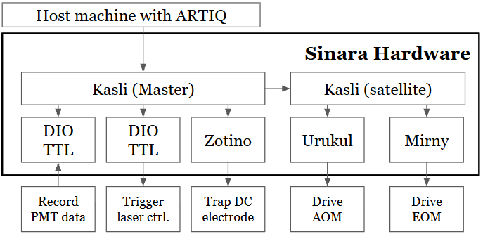

# Configure Sinara hardware system

This is a tutorial for configuring and re-configure your Sinara hardware system.

Related tutorial: [flash Kasli and Kasli SOC](flash_kasli_and_kasliSOC.md)

## The Orchrastator - Kasli cards

The Sinara hardware ecosystem conatins many different types of real-time input and output cards. To coordinate them, Sinara uses a central controller to orchrastate these RTIOs, named the Kasli cards.

The Kasli cards are FPGA-based controller cards used to manage and interface other Sinara cards using Eurocard Extension Modules (EEMs) standards. It is the entry point for ARTIQ to communicate with the rest of the hardware. For more technical detail, see [manual](https://m-labs.hk/artiq/manual/core_device.html#kasli-and-kasli-soc).

An example of a Sinara hardware topology.

  

Since Kasli is the interface between ARTIQ and the rest of the Sinara hardware, configure the hardware often means configuring the Kasli card. Since Kasli uses FPGA technology, configuring it physically means specifing the configuration in some type of hardware description language (HDL), complie it into a bitstream, and flashing the bit streram onto the FPGA chip. The rest of this page will to walk through this process in more detail.

## Configuration high level step-by-step

0. Design your hardware topology and connec the physical devices
1. Specify your hardware configuration and connectivity in a JSON file following the [core-device-schema](artiq/coredevice/coredevice_generic.schema.json)
2. Generate the gateware binary using the config JSON, [see ref1](https://m-labs.hk/artiq/manual/flashing.html#obtaining-board-binaries), and [ref2](https://git.m-labs.hk/M-Labs/artiq/src/branch/master/artiq/gateware/targets/kasli.py). This should provide you with a `device_db.py` file and set of binary files (binary files will vary depending on your target FPGA, KasliSoC vs. Kasli)
3. Flash the binaries onto the Kasli cards [see flash Kasli and Kasli SOC](flash_kasli_and_kasliSOC.md)

## The configuration JSON

WIP
